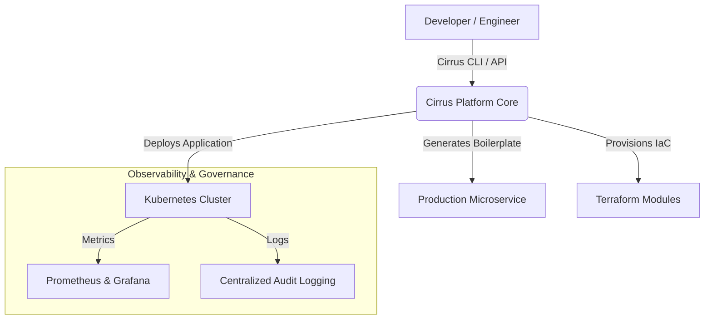

# ☁️ Cirrus Platform — Enterprise Internal Developer Platform (IDP)

> **Cirrus Platform** is an enterprise-grade Internal Developer Platform (IDP) engineered to streamline cloud infrastructure, eliminate developer friction, and enforce golden paths for microservices deployment at scale.

---

## 🎯 The Problem & Value Proposition

Modern engineering teams often face cognitive overload when managing complex Kubernetes configurations, Cloud IaC, CI/CD pipelines, and observability stacks.

**Cirrus Platform** abstracts underlying infrastructure complexities through a self-service CLI/API. Developers can scaffold, provision, and deploy production-ready microservices in seconds while maintaining strict security, compliance, and observability standards.

### Key Metrics & Benefits

* **Onboarding Time:** Reduced service scaffolding from days to **< 30 seconds**.
* **Governance & Security:** Built-in compliance, RBAC, and automated security scans.
* **Operational Efficiency:** Standardized Terraform IaC modules and Kubernetes Helm deployments.

---

## High-Level System Architecture

---

## Tech Stack & Ecosystem

| Layer | Technologies |
| :--- | :--- |
| **Self-Service Engine** | TypeScript / Node.js CLI, Commander.js |
| **Infrastructure as Code** | Terraform, LocalStack, AWS/GCP Simulation |
| **Container & Orchestration** | Docker, Kubernetes (Kind / K3s), Helm |
| **CI/CD Automation** | GitHub Actions, GitOps workflows |
| **Observability** | Prometheus, Grafana Stack |

---

## 📄 Documentation

Detailed technical blueprints and C4 Architecture Diagrams are available in [`/docs/architecture/C4_MODEL.md`](docs/architecture/C4_MODEL.md).

---

*Maintained by Engineering Team • Cirrus Platform 2026*
